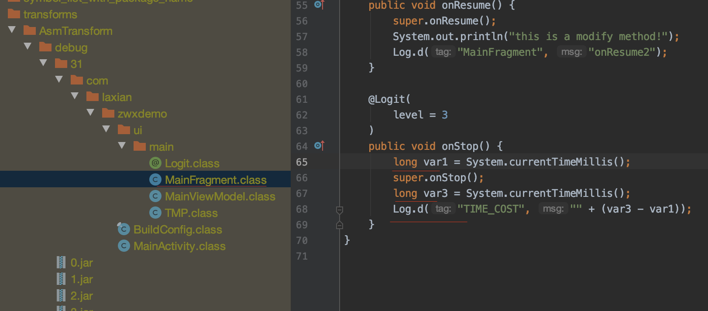

# ASM修改字节码最简demo

ASM 是一个字节码修改框架，配合gradle transform API，可以在编译时动态的在class文件中修改代码
demo 针对MainFragment中@Logit注解的方法，自动添加时间统计，并Log输出

#### 1. 新建或打开gradle项目

#### 2. 新建java library module，名字固定**buildSrc**

buildSrc是编写gradle插件的固定名称

#### 3. 修改buildSrc module的build.gradle
```gradle
apply plugin: 'groovy'

repositories {
    google()
    jcenter()
}

dependencies {
    implementation gradleApi()
    implementation localGroovy()
    implementation 'com.android.tools.build:gradle:3.6.4'
    implementation 'org.ow2.asm:asm-all:5.2'
}
```
#### 4. 编写plugin实现类，jvm语言都可以，推荐groovy语言
```java
public class MyPlugin implements Plugin<Project> {
    @Override
    public void apply(Project project) {
        System.out.println("MyPlugin -> apply");
        AppExtension ext = project.getExtensions().findByType(AppExtension.class);
        assert ext != null;
        ext.registerTransform(new AsmTransform(project));
    }
}
```

#### 5. 编写transform 实现类
```java
class AsmTransform extends Transform {
...
    @Override
    public void transform(TransformInvocation transformInvocation) throws TransformException, InterruptedException, IOException {
        transformInvocation.getInputs().forEach(input -> {
            input.getDirectoryInputs().forEach(dir -> {
                if (dir.getFile().isDirectory()) {
                    transformDir(dir.getFile());

                    File dest = transformInvocation.getOutputProvider().getContentLocation(dir.getName(),
                            dir.getContentTypes(), dir.getScopes(),
                            Format.DIRECTORY);
                    try {
                        FileUtils.copyDirectory(dir.getFile(), dest);
                    } catch (IOException e) {
                        e.printStackTrace();
                    }
                }
            });

            input.getJarInputs().forEach(jarInput ->{
                String jarName = jarInput.getName();
                String md5Name = DigestUtils.md5Hex(jarInput.getFile().getAbsolutePath());
                if (jarName.endsWith(".jar")) {
                    jarName = jarName.substring(#### 0, jarName.length() - 4);
                }
                File dest = transformInvocation.getOutputProvider().getContentLocation(jarName + md5Name,
                        jarInput.getContentTypes(), jarInput.getScopes(), Format.JAR);
                try {
                    FileUtils.copyFile(jarInput.getFile(), dest);
                } catch (IOException e) {
                    e.printStackTrace();
                }
            });
        });
    }
...
    private void transformDir(File file) {
        for (File f : file.listFiles()) {
            if (f.isDirectory()) {
                transformDir(f);
            } else {
                transformFile(f);
            }
        }
    }    
...    
    private void transformFile(File f) {
        if (f.getPath().contains("MainFragment")) {
            System.out.println(f.getName());
            try {
                ClassReader reader = new ClassReader(new FileInputStream(f));
                ClassWriter writer = new ClassWriter(reader, ClassWriter.COMPUTE_MAXS);
                ClassVisitor visitor = new AsmClassVisitor(writer);
                reader.accept(visitor, ClassReader.EXPAND_FRAMES);
                byte[] code = writer.toByteArray();
                FileOutputStream fos = new FileOutputStream(f.getAbsolutePath());
                fos.write(code);
                fos.close();
            } catch (Exception e) {
                e.printStackTrace();
            }
        }
    }
...    
```
#### 6. 针对特定的类，修改字节码

上述代码中，`if (f.getPath().contains("MainFragment")) {`针对MainFragment进行修改。
ASM修改的是字节码，语法相对难懂。使用`ASM Bytecode outline`插件，可以快速生成ASM操作代码.


主要代码：

```Java
// AsmClassVisitor.java
    @Override
    public MethodVisitor visitMethod(int access, String name, String desc, String signature, String[] exceptions) {
        if (name.equals("onResume")) {
            MethodVisitor methodVisitor = super.visitMethod(access, name, desc, signature, exceptions);
            return new AsmMethodVisitor(ASM#### 5, methodVisitor, access, name, desc);
        }
        return super.visitMethod(access, name, desc, signature, exceptions);
    }
// LogMethodVisitor.java    

    private static final String ANNOTATION_SIGNATURE = "Lcom/laxian/zwxdemo/ui/main/Logit";
    private boolean isInsert;
    
    @Override
    protected void onMethodEnter() {
        Label l0 = new Label();
        mv.visitLabel(l0);
        mv.visitLineNumber(7, l0);
        mv.visitMethodInsn(INVOKESTATIC, "java/lang/System", "currentTimeMillis", "()J", false);
        mv.visitVarInsn(LSTORE, 1);
        super.onMethodEnter();
        System.out.println(TAG + "onMethodEnter");
    }

    @Override
    protected void onMethodExit(int opcode) {
        Label l1 = new Label();
        mv.visitLabel(l1);
        mv.visitLineNumber(8, l1);
        mv.visitMethodInsn(INVOKESTATIC, "java/lang/System", "currentTimeMillis", "()J", false);
        mv.visitVarInsn(LSTORE, 3);
        Label l2 = new Label();
        mv.visitLabel(l2);
        mv.visitLineNumber(9, l2);
        mv.visitLdcInsn("TIME_COST");
        mv.visitTypeInsn(NEW, "java/lang/StringBuilder");
        mv.visitInsn(DUP);
        mv.visitMethodInsn(INVOKESPECIAL, "java/lang/StringBuilder", "<init>", "()V", false);
        mv.visitLdcInsn("");
        mv.visitMethodInsn(INVOKEVIRTUAL, "java/lang/StringBuilder", "append", "(Ljava/lang/String;)Ljava/lang/StringBuilder;", false);
        mv.visitVarInsn(LLOAD, 3);
        mv.visitVarInsn(LLOAD, 1);
        mv.visitInsn(LSUB);
        mv.visitMethodInsn(INVOKEVIRTUAL, "java/lang/StringBuilder", "append", "(J)Ljava/lang/StringBuilder;", false);
        mv.visitMethodInsn(INVOKEVIRTUAL, "java/lang/StringBuilder", "toString", "()Ljava/lang/String;", false);
        mv.visitMethodInsn(INVOKESTATIC, "android/util/Log", "d", "(Ljava/lang/String;Ljava/lang/String;)I", false);
        mv.visitInsn(POP);
        super.onMethodExit(opcode);
        System.out.println(TAG + "onMethodExit" + opcode);
    }

    @Override
    public AnnotationVisitor visitAnnotation(String desc, boolean visible) {
        if (ANNOTATION_SIGNATURE.equals(desc)) {
            isInsert = true;
        }
        System.out.println(TAG + "visitAnnotation" + desc + visible);
        return super.visitAnnotation(desc, visible);
    }
```


#### 7. 设置plugin

plugin 命名：`XXX`，如下路径，创建一个 `XXX.properties`
如下：plugin的名字就是`com.laxian.demo-plugin`
```shell
buildSrc/src/main/resources
└── META-INF
    └── gradle-plugins
        └── com.laxian.demo-plugin.properties
```

#### 8. 应用plugin

`apply plugin: 'com.laxian.demo-plugin'`

#### 9. build

#### 10. 验证
`<your_module>/build/intermediates/transforms/AsmTransform/debug/0/<path.to.your.class>`
找到class，双击在studio中查看
